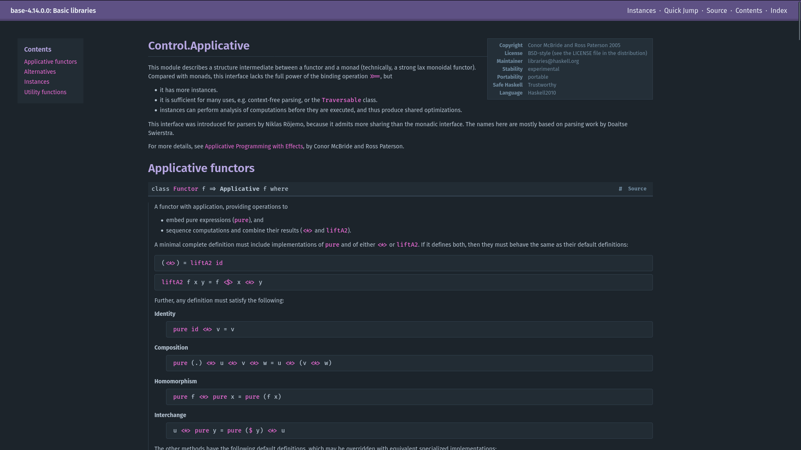
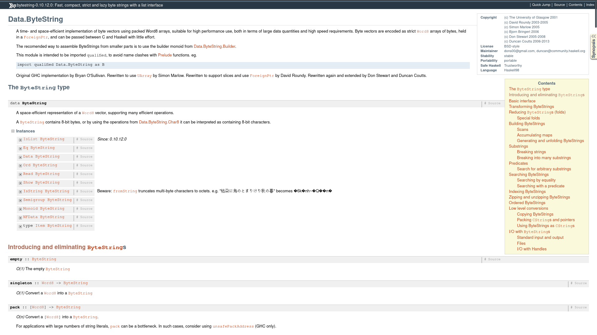

# Hackage Dark

A dark theme for Hackage.

Above picture is showing the [Control.Applicative](https://hackage.haskell.org/package/base-4.14.0.0/docs/Control-Applicative.html) module.

---

Using some deep CSS3 magic I managed to make the old Ocean Haddock theme look alike. Here's a comparison showing the [Data.ByteString](https://hackage.haskell.org/package/bytestring-0.10.12.0/docs/Data-ByteString.html) module before and after:

---

And here's what the syntax highlighting looks like, again showing the [Data.ByteString](https://hackage.haskell.org/package/bytestring-0.10.12.0/docs/Data-ByteString.html) module. The syntax highlighting varies between Haddock versions used to generate the HTML. Sadly there's nothing I can do about that.

## Installation

1. Install the Stylus add-on for [Firefox](https://addons.mozilla.org/en-US/firefox/addon/styl-us/), [Chrome](https://chrome.google.com/webstore/detail/stylus/clngdbkpkpeebahjckkjfobafhncgmne) or [Opera](https://addons.opera.com/en/extensions/details/stylus/)
2. Click [here](https://raw.githubusercontent.com/MarcolateMilk/hackage-dark/master/hackage-dark.user.css)

## Copyright

The pictures above are showing documentation and code I do not own, all credit goes to the original authors. You can find a copy of the copyright notice and licence for the `base` package (shown in the first picture) [here](https://hackage.haskell.org/package/base-4.14.0.0/src/LICENSE) and for the `bytestring` package (shown in the other 3 pictures) [here](https://hackage.haskell.org/package/bytestring-0.10.12.0/src/LICENSE).
